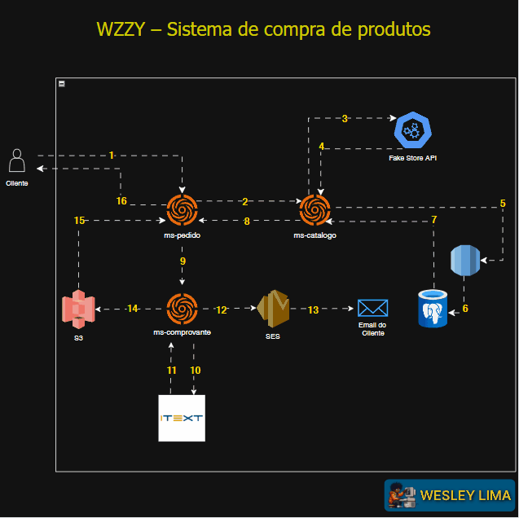

<p align="center">
  
</p>

## PROJETO PESSOAL - MS-PEDIDO  📚:

#### 📖 Descrição:
Microsserviço de **Pedido**, responsável por interagir com outros microsserviços para realizar a orquestração de uma compra. Ele consome o microsserviço de catálogo (`ms-catalogo`) para obter dados dos produtos e interage com o microsserviço de comprovantes (`ms-comprovante`) para registrar o comprovante de uma compra.

- [`ms-catalogo`](https://github.com/R2DWess/ms-catalogo) – consulta e persistência de produtos via Fake Store API + PostgreSQL (RDS)
- [`ms-pedido`](https://github.com/R2DWess/ms-pedido) – orquestrador que recebe as solicitações de compra e aciona os demais serviços
- [`ms-comprovante`](https://github.com/R2DWess/ms-comprovante) – geração de PDF, envio por e-mail e armazenamento S3

---
## 🔁 Fluxo de Arquitetura utilizada



1. Cliente → `ms-pedido`: Início da requisição de compra.
2. `ms-pedido` → `ms-catalogo`: Requisição de validação de produtos.
3. `ms-catalogo` → Fake Store API: Consulta externa dos produtos.
4. Fake Store API → `ms-catalogo`: Resposta com detalhes dos produtos.
   5 → 6. `ms-catalogo` → PostgreSQL (via RDS): Persistência dos produtos.
7. PostgreSQL → `ms-catalogo`: Confirmação da persistência.
8. `ms-catalogo` → `ms-pedido`: Retorno dos produtos persistidos.
9. `ms-pedido` → `ms-comprovante`: Geração do comprovante.
   10 → 11. `ms-comprovante` → iText: Geração do PDF.
12. `ms-comprovante` → SES: Envio de e-mail com comprovante.
13. SES → E-mail do cliente: Entrega do e-mail.
14. `ms-comprovante` → S3: Armazenamento do PDF com metadados.
15. S3 → `ms-pedido`: Retorno da URI do comprovante.
16. `ms-pedido` → Cliente: Resposta final ao cliente com link do comprovante.
---


#### ⚡ Funcionalidades:
1. 🛍️ Realização de compras a partir de uma lista de produtos;
2. 📉 Consulta de dados dos produtos via integração com o `ms-catalogo`;
3. 📋 Geração de resposta com detalhes da compra realizada;
4. 📢 Integração com outros microsserviços para notificação (em expansão);

#### Métodos de execução:

### 🖥️ **1️⃣ Rodar Localmente**
Para executar o projeto localmente, siga os passos abaixo:

> ⚡ Este projeto **não utiliza banco de dados**.

1. Clone o repositório e navegue até a pasta do projeto.
2. Garanta que o `ms-catalogo` esteja rodando na porta `8081` com o endpoint `/v1/produtos/id/{id}` acessível.
3. Rode o projeto com o comando:

```sh
./gradlew bootRun
```

> ⚠ A aplicação está configurada para rodar na porta `8082`.

### 🔧 Tecnologias utilizadas:
- ☕ Java 21;
- 🍃 Spring Boot;
- 📈 WebClient com WebFlux;
- 📓 Gradle;

---

## 📌 Endpoints e exemplos de uso:

### 🛎️ 1 - Realizar Compra:
```cmd
curl --request POST \
  --url http://localhost:8082/v1/compras \
  --header 'Content-Type: application/json' \
  --data '[1, 2, 3]'
```
**Resposta esperada:**
```json
{
  "mensagem": "Compra processada com sucesso!",
  "produtos": [
    {
      "id": 1,
      "title": "Notebook Dell",
      "price": 3500.00,
      "category": "Eletrônicos"
    },
    {
      "id": 2,
      "title": "Mouse Logitech",
      "price": 150.00,
      "category": "Acessórios"
    }
  ]
}
```

## 🚊 Autor

<table>
  <tr>
    <td align="center">
      <a href="https://www.linkedin.com/in/wesley-lima-244405251/" title="Wesley Lima">
        <br>
        <sub>
          <b>Wesley Lima</b>
        </sub>
      </a>
    </td>
  </tr>
</table>

